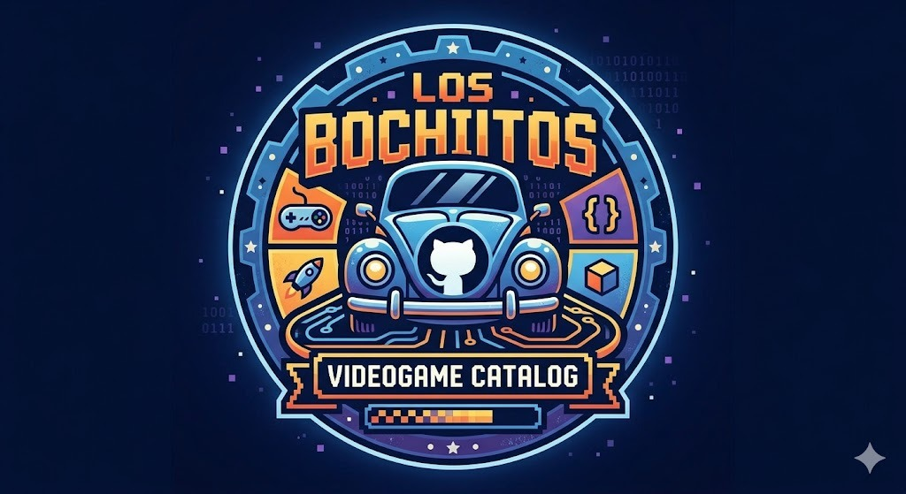

# GIT Trabajo Grupal Los Bochitos

## Integrantes
- Jhosua Alejandro Bustillos Calderon
- Jessica Mayra Quispe Rico
- Jhamil de Jesús Arnez Hidalgo
- Brenda Vargas Mollo
## Sobre el trabajo
Catálogo de videojuegos organizado por categorías, donde puedes explorar juegos, ver sus calificaciones y leer una descripción detallada de cada título.

## ¿Qué es?

Bochito Reviews es una aplicación web estática que permite navegar un catálogo de videojuegos agrupados por género. Al seleccionar una categoría, se muestra la lista de juegos disponibles. Al hacer clic en un juego, se despliega una vista de detalle con su portada, calificación, fecha de lanzamiento, desarrollador, descripción y género.

## Tecnologías

El proyecto fue construido únicamente con tecnologías nativas del navegador, sin frameworks ni librerías externas:

- **HTML** — estructura de las páginas
- **CSS** — estilos y diseño responsivo con variables personalizadas
- **JavaScript** — lógica de componentes y carga de datos
- **JSON** — archivos que funcionan como base de datos de los juegos por categoría

## Git Flow

El proyecto sigue una estrategia de ramas basada en **Git Flow**:

- **main** — rama de producción, contiene la versión estable del proyecto
- **dev** — rama de desarrollo, donde se integran las nuevas funcionalidades antes de pasar a producción
- **feature/*** — ramas de funcionalidades derivadas de **dev**

## Categorías disponibles

| Categoría | Descripción |
|---|---|
| Horror | Terror, suspenso y supervivencia en ambientes oscuros |
| Sandbox | Mundos abiertos con libertad para explorar y crear |
| Deporte | Competencias, torneos y simulación deportiva |
| Carrera | Velocidad, autos y desafíos en distintas pistas |
| Acción-Aventura | Combate, exploración e historias llenas de retos |
| Shooter | Disparos, precisión y acción intensa en combate |


## Estructura del proyecto

```
src/
├── index.html
├── layout/
├── styles/
├── components/
│   ├── button/
│   ├── footer/
│   ├── game-card-list/
│   ├── game-details/
│   ├── header/
│   ├── navbar/
│   └── video-game-card/
└── data/
    ├── accion-aventura-video-game/
    ├── carrera-video-game/
    ├── game-of-the-year/
    ├── horror-video-game/
    ├── sandbox-video-game/
    ├── shooter-video-game/
    └── sport-video-game/
```

Cada carpeta dentro de **data/** contiene un archivo **.json** con los juegos de esa categoría y una carpeta **images/** con sus portadas.


## Arquitectura de componentes

El proyecto usa **Web Components nativos** (**customElements**) para construir la interfaz de forma modular y reutilizable. Cada componente es independiente y maneja su propio HTML, CSS y javascript.

Los componentes principales son:

- **our-layout** — estructura general de la página (header, main, footer)
- **our-header** — cabecera con título y subtítulo
- **our-navbar** — barra de navegación con las categorías
- **game-card-list** — contenedor que carga los juegos desde el JSON y los renderiza
- **game-card** — tarjeta individual de cada juego con portada, título y calificación
- **game-detail** — vista de detalle de un juego con toda su información
- **our-footer** — pie de página
- **our-button** — botón reutilizable con soporte para navegación

---

## Flujo de datos

Los juegos se cargan dinámicamente desde archivos JSON locales. Cada categoría tiene su propio archivo con la siguiente estructura:

```json
{
  "id": "halo-infinite",
  "title": "Halo Infinite",
  "rating": "10.0",
  "src": "./data/shooter-video-game/images/halo-inf.jpeg",
  "coverUrl": "./data/shooter-video-game/images/halo-inf.jpeg",
  "releaseDate": "8 de diciembre, 2021",
  "developer": "343 Industries",
  "genre": "Shooter",
  "description": "..."
}
```

## Cómo correr el proyecto

1. Clona el repositorio
2. Abre la carpeta **src/** con **Live Server** desde VS Code (click derecho en **index.html** → *Open with Live Server*)
3. Navega por las categorías y explora los juegos
